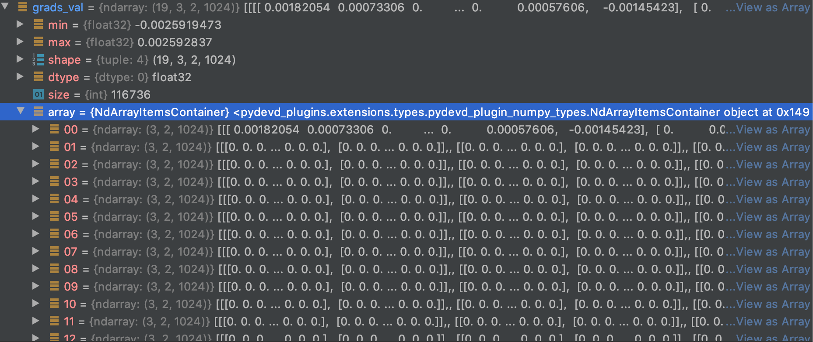

# yamnet_get_gradient
Currently trying to get gradients value from _layer14/pointwise_conv_ layer of [YAMNET](https://github.com/tensorflow/models/tree/master/research/audioset/yamnet).  
YAMNET, provided by tensorflow, contains mel_spec feature extraction and framing within the structure of the tf_model.  
(ex. for instance, audio file included in the project is 10-second long, and converted into 19-framed-mel_spec data while processing)

Therefore, I intended to get grads_val of each frames, but only the first frame was processed properly.

How can I calculate the gradients of each frame?
